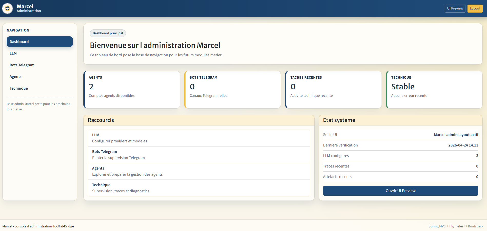

# Marcel Project (formerly Toolkit-Bridge)

## 🚀 Description

Marcel Project est une application agentique locale conçue pour automatiser des actions inter-applicatives.  
Elle permet à une IA de raisonner, collaborer, utiliser des outils et interagir avec votre environnement de travail de manière autonome.  
Pensé comme un véritable “système d’agents”, Marcel transforme votre machine en espace d’exécution intelligent et pilotable.

---

## ✨ Fonctionnalités

- Architecture **multi-agent** permettant collaboration et débat entre agents
- Système de **mémoires pondérées** (conversation, règles, mémoire utilisateur…)
- Mécanisme de **scoring** basé sur importance, fréquence et récence
- **Tooling avancé** : outils intégrés + outils dynamiques via scripting
- Espace de travail dédié pour produire rapports, artefacts et échanges
- Communication et coordination entre agents
- Capacité d’**interaction avec le système** (clics, clavier)
- Approche modulaire orientée orchestration et extensibilité
- Administrable via une interface web admin
- Connecté à Telegram pour le conversationnel et l'alerting

---

## 📸 Aperçu

---

## ⚙️ Installation

### Prérequis

- Java 21
- Maven
- Environnement local (Windows / Linux recommandé)

---

## ▶️ Utilisation

Exemple d’usage conceptuel :

- Définir un objectif (ex : analyser un projet, générer un rapport)
- Lancer un agent ou un groupe d’agents
- Les agents :
  - accèdent à leur mémoire
  - utilisent des outils
  - échangent entre eux
- Résultat : production d’artefacts (rapport, plan, actions…)

---

## 🔧 Configuration

Configuration du projet :

- utilisation de fichiers de configuration (ex : `application.yml`) pour la partie système
- configuration des agents, mémoires et outils via le webadmin

### Éléments configurables

- agents (rôles, capacités)
- systèmes de mémoire (types, pondération)
- outils disponibles
- environnement d’exécution

---

## 🧱 Architecture

### Composants principaux

- **Agents** : unités de raisonnement et d’action
- **Orchestrateur** : gestion des interactions et des workflows
- **Mémoires** :
  - ConversationMemory (court terme)
  - SemanticMemory (faits)
  - RuleMemory (règles)
  - EpisodicMemory (historique)
- **Tooling system** :
  - outils internes
  - outils dynamiques via scripts
- **Workspace** :
  - espace d’échange et de production d’artefacts

### Fonctionnement global

1. Réception d’un objectif
2. Décomposition en tâches
3. Collaboration entre agents
4. Accès mémoire + outils
5. Production de résultats (artefacts)

---

## 🗺️ Roadmap

- Stabilisation des APIs publiques
- Amélioration du système de supervision des agents
- Enrichissement du tooling dynamique
- Optimisation des stratégies de mémoire et scoring

---

## 🤝 Contribution

Les contributions sont les bienvenues :

- amélioration du moteur agentique
- ajout de nouveaux outils
- optimisation des performances
- documentation

---

## 📄 Licence

This project is licensed under the Apache License 2.0 with Commons Clause.

✔ You are allowed to:

- Use the software for personal or internal business use
- Modify and distribute it
- Contribute to the project

❌ You are NOT allowed to:

- Sell this software
- Sell a product or service primarily based on this software

See the LICENSE file for full details.
